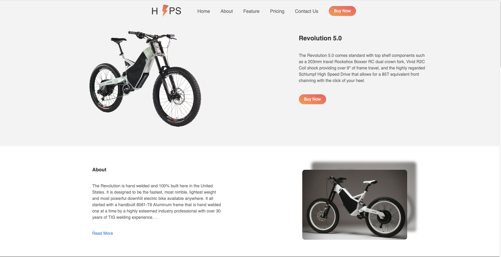
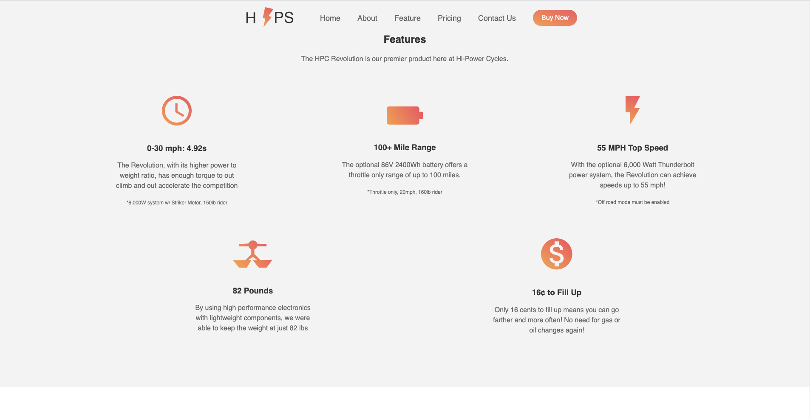
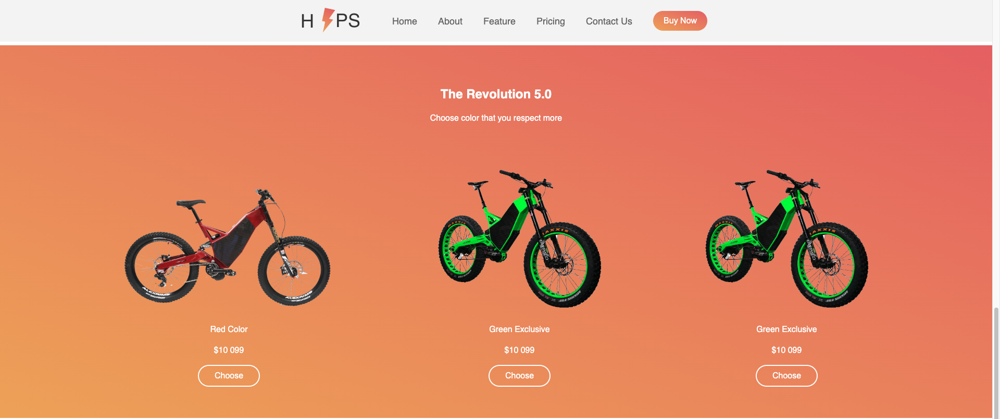
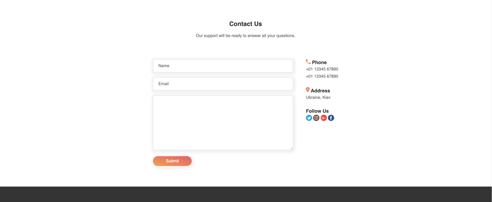

# Product Landing Page
## freeCodeCamp Project

>This project was created while I was learning code from freeCodeCamp.
>Below are the test that I needed to pass while creating this project. Website is not responsive as responsive design was not in requirement.

- User Story #1: My product landing page should have a header element with a corresponding id="header".

- User Story #2: I can see an image within the header element with a corresponding id="header-img". A company logo would make a good image here.

- User Story #3: Within the #header element I can see a nav element with a corresponding id="nav-bar".

- User Story #4: I can see at least three clickable elements inside the nav element, each with the class nav-link.

- User Story #5: When I click a .nav-link button in the nav element, I am taken to the corresponding section of the landing page.

- User Story #6: I can watch an embedded product video with id="video".

- User Story #7: My landing page has a form element with a corresponding id="form".

- User Story #8: Within the form, there is an input field with id="email" where I can enter an email address.

- User Story #9: The #email input field should have placeholder text to let the user know what the field is for.

- User Story #10: The #email input field uses HTML5 validation to confirm that the entered text is an email address.

- User Story #11: Within the form, there is a submit input with a corresponding id="submit".

- User Story #12: When I click the #submit element, the email is submitted to a static page [use this mock URL:](https://www.freecodecamp.com/email-submit).

- User Story #13: The navbar should always be at the top of the viewport.

- User Story #14: My product landing page should have at least one media query.

- User Story #15: My product landing page should utilize CSS flexbox at least once.

## Built With

- HTML
- CSS

## Live Demo

[Live Demo Link](https://ecstatic-roentgen-6fc833.netlify.app)

## Getting Started

To get a local copy up and running follow these steps:

- Download this repository and open the zip file to a location of your choosing.
- Open the index.html file in your browser of preference.

### Prerequisites

Congratulations. If you're viewing this README.md file on a browser, via the internet, with a working computer, you are in possession of the pre-requisites to enjoy our work.

## Author

👤 **Amita Roy**

- Github: [@Amita-Roy](https://github.com/Amita-Roy)
- Twitter: [@AmitaRoy14](https://twitter.com/AmitaRoy14)
- Linkedin: [Amita Roy](https://www.linkedin.com/in/amita-roy-3b823b68/)
- Email: amita.roy@workmail.com

## 🤝 Contributing

The most valuable contribution you can make is honest feedback!

Let us know what you think of our work by getting in touch via social media or by creating an issue here on GitHub.

## Show your support

Give a ⭐️ if you like this project! Follow us and be the first to know about our next project!

## Acknowledgments

- Thanks to [freeCodeCamp](https://www.freecodecamp.org/), for providing the educational resources to learn.
- Thanks to [Uplabs](https://www.uplabs.com/) for inspire us with good design.

## 📝 License

This project is [MIT](lic.url) licensed.
